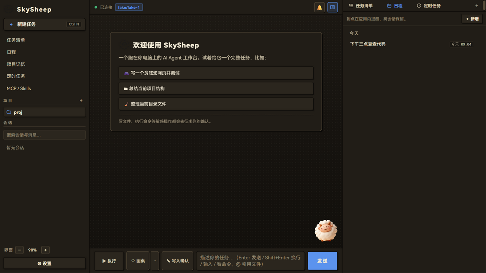
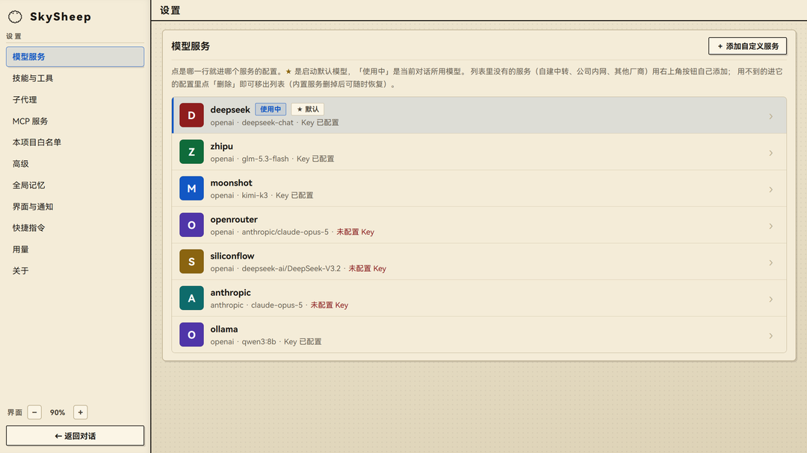
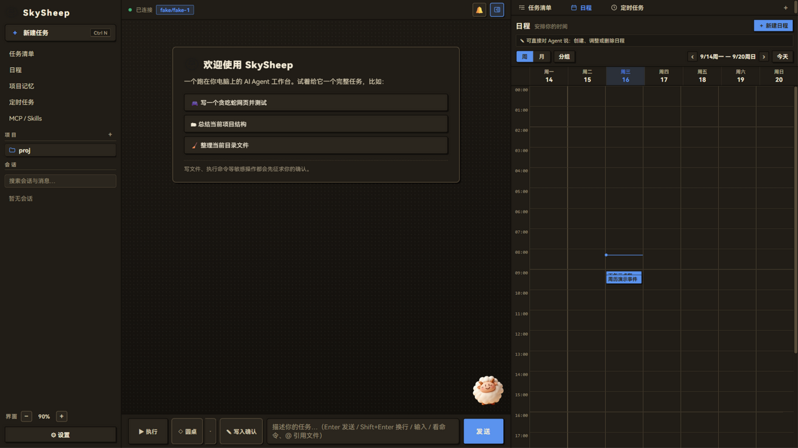
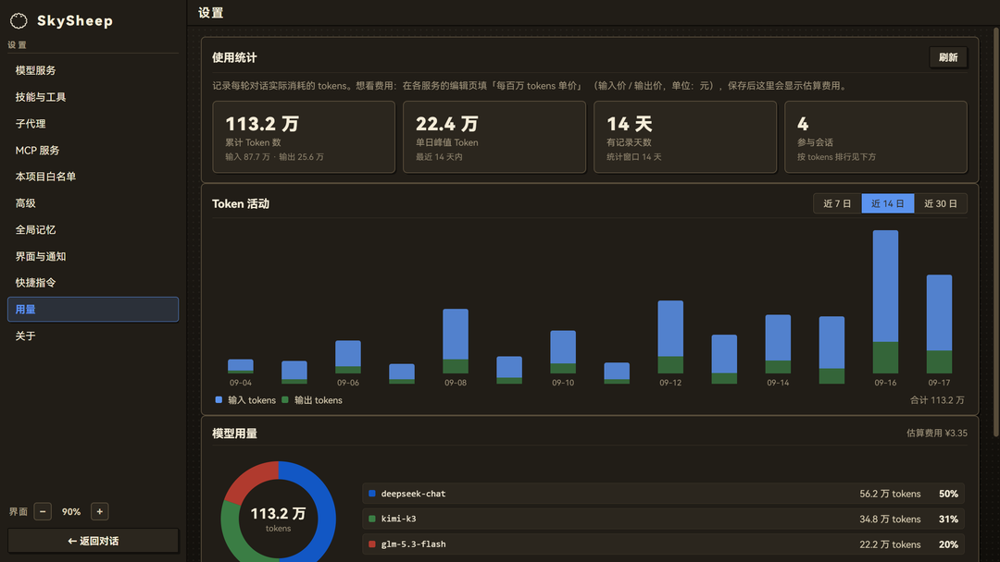

<div align="center">

[](https://sky-scrape.github.io/SkySheep/)

**An open-source desktop AI Agent workbench — reads and writes files, runs commands, operates your computer, and confirms every step with you first.**

[](https://github.com/Sky-scrape/SkySheep/actions/workflows/ci.yml)


[](README.md)
[](https://m8ven.ai/mcp/sky-scrape/skysheep)

[🌐 Website](https://sky-scrape.github.io/SkySheep/) · [⬇️ Download](https://github.com/Sky-scrape/SkySheep/releases/latest) · [📖 中文文档](README.md)

</div>

SkySheep is an open-source AI Agent workbench that runs entirely on your machine: a Python asyncio engine, a pywebview desktop shell, and a zero-build frontend. Hand it a task and it reads and writes files, runs commands, searches the web, operates your computer, and carries multi-step work through on its own. Sessions, configuration, and API keys never leave your machine; sensitive actions such as file writes and command execution pop up a confirmation card by default, and every round of file changes is automatically snapshotted for one-click rollback.

<div align="center">



*The full "Night-ink" dark theme: sidebar, conversation area, live right panel, and the desktop pet*

</div>

## ✨ Highlights

**Roundtable multi-model — one question, several models answering together**

Member models answer independently in parallel; the chairman (the main conversation model) fuses all drafts into one final answer.

- 🎭 **Role presets**: five member roles — critic, fact-checker, concision, pragmatist, and more — balancing sharpness and coverage
- 💬 **Debate rounds**: members see each other's drafts and revise before the fusion; A/B mode keeps every member's original answer
- 📜 **Draft retention**: every draft is persisted with the session for later review, quoting, and follow-ups; seven token-control mechanisms (duplicate-draft dedupe, light member context, per-draft and total budget caps, and more) keep the bill in check

**Task pipelines — chain tasks by dependency and let them run in the background**

Nodes form a DAG pipeline: upstream nodes run in parallel, downstream starts automatically as dependencies land, through to the closing summary.

- ⚙️ **Dependency scheduling**: declare `all` / `any` dependencies and conditional branches; concurrency limits and per-node timeouts are configurable
- 🔁 **Failure resilience**: auto-retry with the last failure reason attached; resumed sessions re-queue with backoff — nothing hangs, nothing is lost
- 📥 **Output passing**: node output is summarized and injected downstream, with full text written to disk for reference; scheduled tasks, sub-agent tasks, and existing sessions can all join as nodes

## 🧩 Features

**Models & conversation**

- Ten built-in provider presets (Anthropic / OpenAI / Gemini / xAI / MiniMax / DeepSeek / Zhipu / Kimi / Qwen / Xiaomi MiMo) + custom relay endpoints; local inference services auto-detected; one-click model listing and context-window detection
- Reasoning effort auto-tuned per task; thinking process streamed live and replayable in a collapsible view; a per-session turn-diagnostics panel in the review page breaks down each round's time (tool counts & slowest tool / permission waits / tokens)
- Automatic context compaction (CJK-aware estimation, adjustable trigger ratio; manual `/compact` from the desktop input box — the CLI has no such command)
- Daily token budget guardrails; a channel alert is pushed when usage crosses the 80% / 100% tiers (at most one per tier per day; alerts follow the channels — with no chat / Webhook channel enabled there is no alert, and the in-app guardrail still applies); usage dashboard by session / provider / model with cost estimation
- Auxiliary chat can run its own model without touching the main conversation
- Prompt library (pinyin-initial filtering, AI polish, import/export); `~` prompts, `/` commands, `@` file references, `&` conversation references; voice input

**Task execution**

- 24 built-in tools: file read/write with precise editing, command execution (with background process management), regex search, web fetch and search (multiple providers), PDF / Word / Excel / PPT / CSV I/O, image understanding, AI image generation; web fetch ships injection defense — external content is wrapped in an explicit boundary frame declaring that instructions inside it are not yours, and a suspected-injection hint is appended when known injection patterns are detected
- Computer control: screenshot, mouse, keyboard, window, clipboard (off by default; enable in settings)
- Sub-agents: six built-in roles + custom roles (tool scope / model / reasoning effort configurable); parallel background execution with queuing; isolated spawns on a dedicated git worktree that auto-commits to its own branch
- Execute / plan dual mode with a live-synced task list; task duration estimates and actual-time logging
- Per-round checkpoints — undo this round's file changes with one click; rollbacks survive restarts

**Automation & memory**

- Scheduled tasks (recurring, with pre-authorized tool lists) and agenda reminders (weekly / monthly calendar, advance reminders); task and pipeline final states plus a daily run digest can be pushed to Feishu / WeChat / a generic Webhook, tasks can be exported as Windows scheduled tasks (they fire even when the app is closed), and the automation panel's "Today" card summarizes the day's runs
- Project memory edited in-app; global auto memory; archive-time memory distillation; scheduled memory tidy-up (originals backed up first); oversized global memory is injected by per-turn relevance (embedding-similarity ranking via a local Ollama when installed, rule scoring otherwise), and noteworthy facts from each round land as pending-review candidates that only reach memory after you adopt them
- Memory map: project evolution timeline, topic association graph, LLM-generated evolution summary
- Hooks: pre tool-call (can block) / post / task-finished, with a tester and a recent-runs panel
- `skysheep run` headless one-shot execution: pre-authorized tool list, JSON output, script-friendly

**Extensions & connectivity**

- MCP client: stdio / Streamable HTTP, Claude Desktop config compatible, seven built-in presets, bounded auto-reconnect
- Skill packages: global / project scopes; import from a folder, a .zip, or a GitHub/Gitee URL; scan-and-import skills already on this machine; twenty official scenario templates bundled — one-click install uses the in-app copy and works offline; /save-skill turns the current session's approach into a skill draft in one command
- Remote access: LAN token + QR code opens the full UI on your phone; Tailscale supported for cross-network access
- Chat channels: Feishu (WebSocket long connection) / WeChat (QR login); read-only by default, optional approval cards with timeout auto-deny. Generic Webhook channel: outbound-only pushes (optional HMAC signature verification), no inbound allowlist concept
- Desktop form factor: six themes + follow-system, system tray, launch at startup, window geometry memory, global hotkey, desktop pet; multiple session tabs and a ten-tab right panel (terminal / browser / review / files / tasks / agenda / automation / project memory / memory map / MCP·Skills)
- Session management: full-text search (Chinese-aware), session branching, pin / archive / tags, Markdown / HTML export, rolling backups with visual restore

## 🖼 Screenshots

| Model provider settings | Agenda weekly view | Usage dashboard |
|:---:|:---:|:---:|
|  |  |  |
| Paste an API key into a built-in preset to connect | Scheduled tasks and reminders land on the calendar and fire on time | Token usage and cost estimates, per session |

## 🆚 Benchmarked Against Mainstream Agents

SkySheep's feature set was built item by item against Claude Code / OpenAI Codex CLI / ZCode (✅ = implemented). The CLIs are stronger in terminal ecosystem and CI integration; SkySheep provides a full desktop GUI built for everyday users: Chinese-first, roundtable multi-model, task pipelines, computer control, and remote & chat channels. The current release is **Windows-first**; macOS/Linux are on the roadmap (the `--browser` mode provides a cross-platform fallback).

| Capability | Claude Code | Codex CLI | ZCode | SkySheep |
|---|---|---|---|---|
| Agent loop (streaming + tool calls) | ✅ | ✅ | ✅ | ✅ |
| Multi-model / multi-provider (OpenAI-compatible + Anthropic + local) | — | ✅ | ✅ | ✅ built-in presets + custom relay endpoints + auto model detection |
| MCP client (stdio/HTTP, Claude Desktop config compatible) | ✅ | ✅ | ✅ | ✅ in-app import / manual entry / templates + one-click built-in presets, hot-applied |
| Skill packages (SKILL.md, progressive disclosure) | ✅ | ✅ | ✅ | ✅ dedicated skills page: global/project scopes, per-project scope limits, full-text preview; import from folder/.zip/GitHub·Gitee URL + "scan this computer" |
| Sub-agents (background tasks + polling) | ✅ | ✅ | ✅ | ✅ spawn_agent / check_task + custom sub-agents |
| Project memory (AGENTS.md / CLAUDE.md) | ✅ | ✅ | ✅ | ✅ edited in-app + global auto memory (across projects) |
| Memory map (project evolution visualization) | — | — | — | ✅ evolution timeline + topic graph + LLM-generated evolution summary (file footprints / activity heatmap / task & memory annotations) |
| Task lists (todos) | ✅ | ✅ | ✅ | ✅ sidebar panel synced in real time |
| Plan mode (plan first, then execute) | ✅ | — | ✅ | ✅ dual execute/plan modes + one-click execute-the-plan |
| Automatic context compaction + manual /compact | ✅ | ✅ | ✅ | ✅ CJK-aware estimation + real-usage floor as a fallback (manual /compact from the desktop input box only) |
| Permission prompts + project whitelist | ✅ | ✅ | ✅ | ✅ confirmation flow + word-boundary command-prefix whitelist (rejects shell-chaining bypass) + tiered permission modes + workspace trust (repo-bundled MCP/skills require confirmation) |
| Headless one-shot runs (scripts / CI) | ✅ -p | ✅ exec | ✅ -p | ✅ skysheep run (pre-authorized tools + JSON output + audit) |
| Ignore files | ✅ | ✅ | ✅ | ✅ .skysheepignore (.gitignore semantics, .env ignored by default) |
| Slash commands | ✅ | ✅ | ✅ | ✅ /help /new /model /export (CLI & desktop); /compact /status /todos (desktop input box only — see /help for the full CLI set) |
| Message queuing / auto-retry on transient errors | ✅ | ✅ | ✅ | ✅ exponential backoff; in-flight content is never replayed |
| Web fetch + web search | ✅ | ✅ | ✅ | ✅ web_fetch (SSRF protection) + web_search (Bocha/Tavily/Zhipu/self-hosted SearXNG) |
| Document reading + generation | ✅ | — | ✅ | ✅ read_document (PDF/Word/Excel/PPT) + write_document (docx/xlsx/csv/PPT) |
| Image input (multimodal) | ✅ | ✅ | ✅ | ✅ paste/drag-and-drop multimodal |
| Image generation | — | — | — | ✅ CogView/Kolors image generation |
| Computer use | — | — | — | ✅ screenshot/mouse/keyboard/window/clipboard (off by default; confirmation-gated + action whitelist) |
| Thinking visualization | ✅ | ✅ reasoning summaries | — | ✅ ThinkingDelta streaming + collapsible replay + thinking time |
| Task time estimates / duration logging | — | — | ✅ | ✅ estimates a range when taking over; actual duration recorded per round and persisted with the message |
| Checkpoints / undo this round's file changes | ✅ checkpoints | — | ✅ | ✅ persisted to disk; rollbacks survive restarts |
| Session search / management | ✅ | ✅ | ✅ | ✅ cross-project full-text search + visual backup restore + Markdown/HTML export |
| Right-side panel (terminal / browser / side chat / review / files / tasks / agenda) | — | — | ✅ | ✅ multiple session tabs in parallel |
| Hooks (pre/post tool-call hooks) | ✅ | ✅ PreToolUse etc. | ✅ | ✅ [hooks] in config.toml; pre-hooks can block |
| Light/dark themes / desktop form factor | ✅ terminal themes | ✅ syntax themes | ✅ | ✅ six themes (Paper-ink / Celadon / Persimmon / Night-ink / Indigo / Pine) + follow system + system tray + launch at startup + installer |
| LAN remote access (continue on your phone) | — | — | — | ✅ token + QR code; listens on localhost only by default |
| Cross-network remote access (Tailscale) | — | — | — | ✅ reach home from any network; shares the token with LAN; non-tailnet sources rejected outright |
| Chat bot channels (Feishu / WeChat) | — | — | — | ✅ Feishu (App ID/Secret + WebSocket long connection) + WeChat (QR login); off by default, empty allowlist denies everything, read-only when unattended, optional approval with timeout auto-deny |

> Competitor columns reflect **first-party, built-in features per each vendor's official docs as of 2026-09** (extensions, plugins, and cloud companions not counted); these products evolve quickly — defer to the official docs.

## 🚀 Installation & Running

**Installer (recommended for everyday users)**

Download `SkySheep-<version>-setup.exe` from [Releases](https://github.com/Sky-scrape/SkySheep/releases/latest) and double-click to install. If Windows SmartScreen blocks the first launch, click "More info → Run anyway" (standard treatment for unsigned programs; see the [SmartScreen walkthrough](docs/smartscreen-说明.md)).

**Run from source (developers)**

```bash
cd SkySheep/engine
uv sync                          # Install dependencies (Python >= 3.11)
uv run skysheep app              # Desktop app (--browser opens in a browser)
uv run skysheep chat             # Terminal session
uv run skysheep run "task"       # One-shot headless run (JSON output supported)
```

**Initial setup**

A first-launch wizard connects a provider in three steps (pick a service → paste the key → go) and auto-detects local inference services; without an API key you can enter demo mode and watch a full round of real tool calls.

<details>
<summary><b>📦 Double-click launch / packaging</b> (expand)</summary>

```bash
cd engine
.venv\Scripts\python.exe tools\install_shortcut.py        # Start-menu/desktop shortcuts (source build)
.venv\Scripts\python.exe tools\install_shortcut.py --exe  # Point at the packaged SkySheep.exe
uv pip install pyinstaller
.venv\Scripts\pyinstaller.exe --noconfirm --clean SkySheep.spec   # Output: dist/SkySheep/SkySheep.exe
```

Single-file installer: install [Inno Setup 6](https://jrsoftware.org/isdl.php), then run `ISCC.exe tools\installer.iss`; the output lands in `installer/`. Or run `python tools/release.py` for a one-command package → verify → smoke-test → installer chain (build-only by default; `--upload` performs the release upload).

</details>

> **📦 Multiple instances**: source builds run under a `dev` identity by default, with data in `~/.skysheep-dev/` — isolated from the installed app's `~/.skysheep/` and safe to run side by side; the `SKYSHEEP_INSTANCE` environment variable spawns further independent instances.

> **⏰ Scheduled tasks require the app to be running**: scheduled tasks and agenda reminders fire from the app's internal loop. Choose "Minimize to system tray" when closing to keep them running in the background; tasks that come due while fully exited are caught up on the next launch. Enable "Launch at startup" under Settings → Advanced for always-on duty. Need a task to fire even when the app is fully closed? Export it as a Windows scheduled task from the task card ("⊞" button; registered via `schtasks` as "SkySheep-<task id>" and run standalone as `skysheep cron run <task id>`).

## 🔒 Security

Security is the default behavior, no configuration required:

- **Confirmation-gated permissions**: read-only actions run through automatically; file writes (with a diff preview) and command execution prompt for confirmation one by one. Three permission modes — Safe execution / Auto-edit (auto-approves writes inside the working directory only) / Full access; relaxed modes can only be switched from the local UI
- **Command whitelist**: matches by full word prefix; commands carrying shell chaining or interpreter flags never match a rule and always re-confirm; rules persist per project, managed in settings
- **Workspace trust & network protection**: a project's bundled MCP and skill configs require explicit trust before use; web fetch is restricted to public http(s) with SSRF protection and aborts oversized responses
- **Local data & rollback**: sessions, config, and keys stay on your machine with zero telemetry; file changes are snapshotted per round and reversible; the session database rolls automatic backups; exported diagnostic bundles are redacted automatically

<details>
<summary><b>Fine-grained mechanisms</b> (expand)</summary>

- Four whitelist rule kinds (whole tool / word prefix / exact arguments / glob); interpreter `-c / -e / --eval` flags are full-text scanned so they can't smuggle a command past a prefix rule; legacy rules that no longer match after the 2.3.0 tightening are badged "stale" in the settings page (hover for the reason) for easy per-rule cleanup
- Computer control converges per action: the action whitelist only remembers the exact confirmed action — closing windows / writing the clipboard is never allowed as a whole tool
- `web_fetch` pins resolved IPs as the connection target (anti-DNS-rebinding) and re-checks redirects hop by hop
- Checkpoints: 50 rounds per session, 500 per project; session backups keep 20 copies, restorable visually
- MCP tool descriptions are length-capped against context crowding and injected instructions; the system prompt ships with a prompt-injection defense — web / document content is treated as data

</details>

## 🏗 Architecture

```
┌──────────────────────────────────────────────────────────────────┐
│ Desktop shell: pywebview native window (WebView2)                │
│  └─ Browser fallback (--browser)                                 │
├──────────────────────────────────────────────────────────────────┤
│ Local server layer: FastAPI + WebSocket                          │
│  └─ JSON-RPC requests + AgentEvent event stream                  │
│  └─ Zero-build frontend (vanilla HTML/CSS/JS, served statically) │
├──────────────────────────────────────────────────────────────────┤
│ SkySheep Engine (Python 3.11+, asyncio)                          │
│  ├─ core/      Agent loop, event stream, sub-agents,             │
│  │             compaction, checkpoints                           │
│  ├─ models/    Provider layer (openai/anthropic/fake)            │
│  ├─ tools/     Built-in tools (incl. web_fetch) + schema export  │
│  ├─ security/  Permission Gate + whitelist                       │
│  ├─ skills/    Skill discovery / toggle / injection / install    │
│  ├─ mcp/       MCP client (stdio/HTTP)                           │
│  ├─ session/   SQLite persistence + full-text search             │
│  ├─ config.py  ~/.skysheep/config.toml                           │
│  └─ cli/       Terminal REPL / desktop launcher                  │
└──────────────────────────────────────────────────────────────────┘
```

Design keynote: **event-stream driven** — the entire agent run is modeled as `AgentEvent`s, and the CLI, GUI, and WebSocket server all consume the same engine API; sensitive operations go through the `PermissionGate`, which emits a confirmation event and suspends until the frontend decides.

Auditability: all project source (the Python engine and the frontend trio) ships as readable, unobfuscated code; the mermaid/xterm bundles under `static/vendor/` are upstream build artifacts of third-party libraries (versions pinned, never modified).

## 🤝 Development & Contributing

```bash
cd engine
uv run pytest        # Full test suite (-m "not e2e" skips the real-socket tests; -m eval runs the 30-scenario behavioral eval baseline)
uv run ruff check .  # lint
```

Contributions are welcome! See [CONTRIBUTING.md](CONTRIBUTING.md). To report a security vulnerability, use the private channel in [SECURITY.md](SECURITY.md) — please don't open a public issue. See [CODE_OF_CONDUCT.md](CODE_OF_CONDUCT.md) for the code of conduct.

Running into a problem? In the app, go to Settings → About → "💬 Report an issue" to auto-package a redacted diagnostic bundle and open the feedback page.

## 🗺 Roadmap & Non-goals

- ✅ current release **v2.4.1**: engine core → MCP / Skills ecosystem → desktop app → roundtable multi-model & task pipelines → memory map → review-hardening passes and structural refactors (full history in [CHANGELOG.md](CHANGELOG.md))
- 🚧 **Next up**: macOS / Linux support · system-level scheduling · defense-in-depth against prompt injection · code-signed distribution · optional ripgrep acceleration (speeds up large-repo search when a local rg is present; the built-in pure-Python search remains the default)

**Non-goals**:

- **Native mobile apps** — the desktop shell is where permission gates, checkpoints, and the file panel get polished; there is no bandwidth right now for a second, mobile-grade security model.
- **macOS/Linux (for now)** — Windows gets the desktop experience polished first; the `--browser` mode already provides a cross-platform fallback.
- **Vector memory / multi-tier context compaction** — the built-in compaction and archive-time memory digests already cover current usage; not worth growing the install size.
- **Replacing the built-in search with ripgrep** — pure-Python, zero-dependency "install and it works" distribution stays; no bundled binary, but an installed rg may optionally accelerate search (see roadmap).
- **A proprietary plugin JS API** — extension points stay on the two open standards, MCP and Skills; the frontend remains zero-build.
- **An operated skill marketplace** — skills ship via the in-app import flow (folder / .zip / links); no curated store to moderate.

## 📄 License & Sponsorship

Released under the [MIT](LICENSE) license.

Donations are accepted via the channel listed in [.github/FUNDING.yml](.github/FUNDING.yml) — GitHub Sponsors: [Sky-scrape](https://github.com/sponsors/Sky-scrape). The first spending priority is **code-signed distribution**: signed installers remove the Windows SmartScreen warning (see [docs/smartscreen-说明.md](docs/smartscreen-说明.md)) so everyday users can install with a double-click.

---

<div align="center">

☁️ **The cloud sheep is with you** ☁️

</div>
