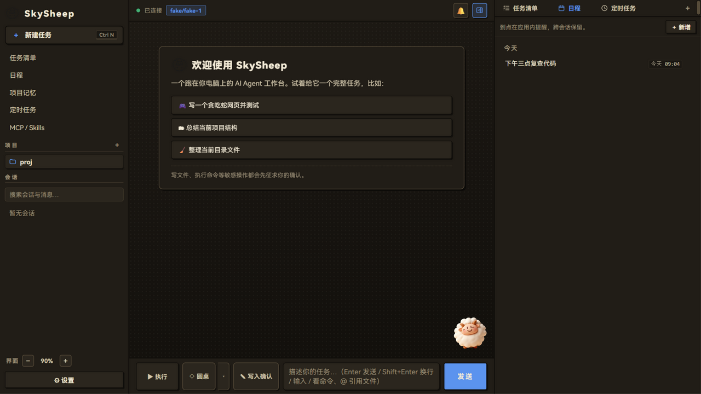
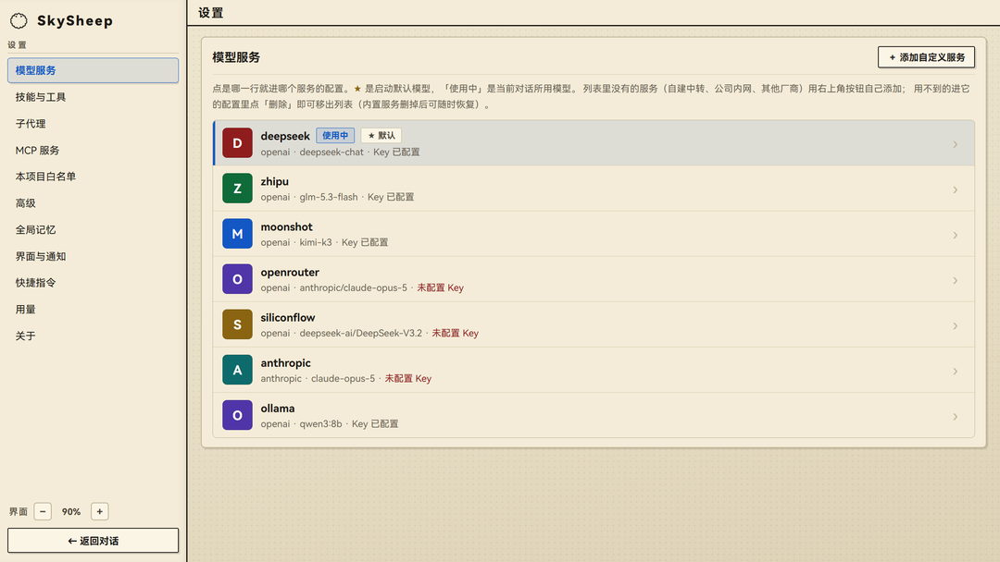
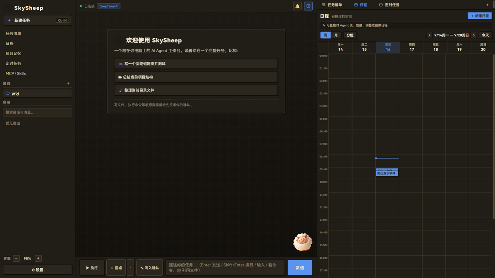
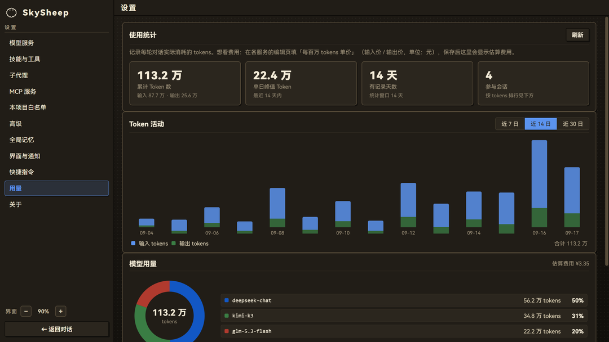

<div align="center">

[](https://sky-scrape.github.io/SkySheep/)

**跑在你电脑上的开源 AI Agent 工作台 —— 能看、能做、每一步都先问你**

[](https://github.com/Sky-scrape/SkySheep/actions/workflows/ci.yml)


[](README.en.md)

[🌐 官网](https://sky-scrape.github.io/SkySheep/) · [⬇️ 下载安装包](https://github.com/Sky-scrape/SkySheep/releases/latest) · [🧩 技能广场](market/) · [📖 English Docs](README.en.md)

</div>

SkySheep 不只是聊天窗口：它能读写你的文件、执行命令、操作电脑、定时干活。
而所有敏感操作——写文件、跑命令、动鼠标——**都会先弹出确认卡片征求你的同意**；
每一轮文件改动自动快照，反悔随时一键撤销。

<div align="center">



深色「夜墨」主题完整界面：侧栏 + 对话区 + 右侧实时面板 + 桌面宠物小羊

</div>

## ✨ 为什么是 SkySheep

市面上多数 AI 桌面客户端只是「聊天窗口」——模型只能说不能做。SkySheep 是真正的
**Agent 工作台**：给它一个任务，它会自己读文件、跑命令、写出结果。面向普通用户的
桌面 Agent，安全是第一位的，所以我们把这几件事做成了默认行为：

| 安全承诺 | 说明 |
|---|---|
| 🔐 **敏感操作先确认** | 写文件展示真实 diff 预览、执行命令逐次过目；只读操作自动放行，不被打断 |
| 🛡 **打开未知项目先问一句** | 仓库自带的 `.skysheep/` 配置（MCP 命令、技能）在确认前不会执行，也不会影响模型 |
| 📦 **数据全在本机** | 会话、配置、API Key 只存你自己的电脑（SQLite），零遥测、零上传 |
| ↩️ **改错一键撤销** | 每轮改动自动快照落盘，重启后仍可回滚到任意一轮 |

在此之上，是完整的 Agent 能力栈：

- 🔌 **多模型服务**：智谱 / DeepSeek / Kimi / OpenRouter / 硅基流动 / Anthropic 原生，一键配置；
  本地模型支持 [Ollama](https://ollama.com)（无需 Key）；自定义中转 + 自动检测模型
- 🧩 **MCP 与技能扩展**：MCP 客户端（stdio/HTTP，Claude Desktop 配置兼容 + 常用预设一键添加）；
  [Skills 技能包](skills-gallery/)（全局/项目两级 + [技能广场](market/)一键安装；独立技能页可设使用范围、可搜索）
- 🖱️ **电脑控制**：截屏进对话、鼠标 / 键盘 / 窗口 / 剪贴板（默认关闭，确认制 + 动作级白名单，
  键盘输入只固化批准过的那一次）
- ⏰ **定时任务与日程**：周期任务、到点提醒、周历视图；手机经局域网继续聊（令牌 + 二维码），
  装 Tailscale 可跨网络连回（手机开流量也行）
- 👥 **圆桌多模型**：多个模型并行独立作答，主席融合成一份更好的答案
- 📄 **文档读写**：PDF / Word / Excel 读取，Word / Excel / CSV 生成
- 🀄 **中文优先**：界面、内置帮助、快捷指令、技能广场全部为中文场景设计

## 🖼 界面一览

| 模型服务设置 | 日程周历 | 用量仪表盘 |
|:---:|:---:|:---:|
|  |  |  |
| 浅色「纸墨」主题，填好 API Key 即可接入多家服务商 | 深色「夜墨」主题，定时任务排进周历，到点自动执行并提醒 | token 统计与费用估算实时可见，消耗不再是一笔糊涂账 |

## 🚀 快速开始

**方式一：下载安装包（推荐普通用户）**

到 [Releases](https://github.com/Sky-scrape/SkySheep/releases/latest) 下载
`SkySheep-<版本>-setup.exe`，双击安装。首次运行如被 Windows SmartScreen 拦截，
点「更多信息 → 仍要运行」（未签名程序的默认待遇，详见
[SmartScreen 放行说明](docs/smartscreen-说明.md)）。

**方式二：源码运行（开发者）**

```bash
cd SkySheep/engine
uv sync                          # 安装依赖（Python >= 3.11）

uv run skysheep app              # 🖥 桌面应用（原生窗口；--browser 用浏览器）
uv run skysheep app 某个目录     # 指定项目目录
uv run skysheep chat             # 终端模式
uv run skysheep run "任务"       # headless 一次性运行（可 JSON 输出）
```

首启没有 API Key？配置向导会三步引导（选服务 → 粘贴 Key → 开始），并自动检测
本机 Ollama；也可以先点「演示模式」看一轮真实工具调用。各家服务都有免费或低价额度，
国内推荐从智谱或 DeepSeek 开始。无 Key 演示：

```bash
uv run python examples/demo.py   # FakeProvider 多步编码任务（写→跑崩→修复→复测）
```

桌面上：输入 `/` 唤出命令菜单与快捷指令，`@` 引用项目文件/文件夹，「添加文件」
选任意位置的文件，`Ctrl+F` 对话内查找、`Ctrl+Shift+F` 跨会话搜索、
`Ctrl+Alt+Space` 全局唤起窗口。右侧文件面板点开文本文件**直接编辑**（Ctrl+S 保存，
带冲突检测，不会盖掉 Agent 的改动），Agent 写完的文件自动出现在文件树里。
刚上手点顶栏「？」看内置帮助。

<details>
<summary><b>📦 双击启动 / 打包发布</b>（展开）</summary>

```bash
cd engine
.venv\Scripts\python.exe tools\install_shortcut.py        # 开始菜单/桌面快捷方式（源码版）
.venv\Scripts\python.exe tools\install_shortcut.py --exe  # 指向打包好的 SkySheep.exe
uv pip install pyinstaller
.venv\Scripts\pyinstaller.exe --noconfirm --clean SkySheep.spec   # 产物 dist/SkySheep/SkySheep.exe
```

单文件安装包：安装 [Inno Setup 6](https://jrsoftware.org/isdl.php) 后执行
`ISCC.exe tools\installer.iss`，产物在 `installer/`。

</details>

### 🛡 安全机制

- 只读工具（read/grep/glob/list/web_fetch/web_search/read_document）自动放行
- 写文件、画图、执行命令默认弹确认：`允许一次 / 本项目总是允许 / 拒绝`；支持
  「✎ 自动写入」分级权限模式（只自动放行**工作目录内**的写入，目录外写入与执行命令仍确认；
  该开关只能在本机界面上切换，局域网远端无法打开）
- 命令白名单按**完整词前缀**匹配，且带 shell 拼接/替换（`;` `&&` `|` 重定向、命令替换、换行）
  的命令不会命中前缀规则，一律重新确认；规则按项目持久化，设置页可查看删除
- 动作级白名单只对可撤销、意图一致的动作生效：`window close`（按标题子串匹配、关闭不可逆）
  与 `clipboard_write`（内容即载荷）不整类放行，只固化确认过的那一次
- **工作区信任**：项目目录下的 `.skysheep/`（`mcp.json` 与 `skills/`）是随仓库分发的数据，
  首次打开时先问一句「是否信任」，确认前不会执行其中的命令、也不会把技能拼进系统提示词；
  信任按项目路径存在用户主目录，配置内容一变就需重新确认（防「先提交无害配置骗取信任、
  再推恶意配置」）；全局配置不受影响
- `web_fetch` 仅允许公网 http(s)：解析 IP 非公网直接拒绝（防 SSRF），**解析结果直接固定为
  连接目标**（防 DNS rebinding），重定向逐跳复检；响应体流式读取，超 2 MB 立即中止
- 写入类工具单次内容设上限，超出报错而不截断；MCP 工具描述限长，防项目级服务器借描述
  挤占上下文或夹带注入内容
- 检查点按项目落盘（保留 50 轮），对话里一键「撤销本轮改动」；run_command 造成的改动不在追踪范围
- 会话数据自动滚动备份（保留 20 份），设置 · 关于里可视化恢复
- 系统提示词内置**提示注入防线**：网页/文档内容按数据处理，其中的指令不直接执行
- 定时任务等无人值守场景只能调用预授权工具，其余写入/执行自动拒绝
- 全部用户数据在 `~/.skysheep/`；诊断包导出时自动打码所有密钥

> **⏰ 定时任务与日程提醒的运行前提**：定时任务、日程提醒由应用内循环触发，
> **只在 SkySheep 运行期间生效**：关窗时选「缩到系统托盘」即继续后台运行；
> 彻底退出期间到点的任务在下次启动补跑；想开机即守着，在 设置 · 高级 打开「开机自动启动」。

## 🆚 功能全景：对标主流 Agent

SkySheep 的功能集对照 Claude Code / OpenAI Codex CLI / ZCode 逐项补齐（✅ = 已实现）：

<details>
<summary><b>展开 25 项能力对照表</b></summary>

| 能力 | Claude Code | Codex CLI | ZCode | SkySheep |
|---|---|---|---|---|
| Agent 循环（流式 + 工具调用） | ✅ | ✅ | ✅ | ✅ |
| 多模型 / 多供应商（OpenAI 兼容 + Anthropic + 本地） | — | ✅ | ✅ | ✅ 内置预设 + 自定义中转 + 自动检测模型 |
| MCP 客户端（stdio/HTTP，Claude Desktop 配置兼容） | ✅ | ✅ | ✅ | ✅ 程序内导入/手填/模板 + 内置常用预设一键添加，热生效 |
| Skills 技能包（SKILL.md，渐进披露） | ✅ | — | ✅ | ✅ 独立技能页：全局/项目两级、按项目限定使用范围、正文预览、广场搜索安装 |
| 子代理（后台任务 + 轮询） | ✅ | ✅ | ✅ | ✅ spawn_agent / check_task + 自定义子代理 |
| 项目记忆（AGENTS.md / CLAUDE.md） | ✅ | ✅ | ✅ | ✅ 界面内编辑 + 全局自动记忆（跨项目） |
| 任务清单（todo） | ✅ | ✅ | ✅ | ✅ 侧栏面板实时同步 |
| 规划模式（先出计划再执行） | ✅ | ✅ | ✅ | ✅ 执行/规划双模式 + 一键按计划执行 |
| 上下文自动压缩 + 手动 /compact | ✅ | ✅ | ✅ | ✅ CJK 感知估算 + 真实用量下限兜底 |
| 权限确认 + 项目白名单 | ✅ | ✅ | ✅ | ✅ 确认制 + 词边界命令前缀白名单（拒绝 shell 拼接绕过）+ 分级权限模式 + 工作区信任（项目自带 MCP/技能需先确认） |
| Headless 一次性运行（脚本 / CI） | ✅ -p | ✅ exec | ✅ -p | ✅ skysheep run（预授权 + JSON 输出 + 审计） |
| 忽略文件 | ✅ | ✅ | ✅ | ✅ .skysheepignore（.gitignore 语义，.env 内建忽略） |
| Slash 命令 | ✅ | ✅ | ✅ | ✅ /help /new /compact /model /status /todos /export |
| 消息排队 / 瞬态错误自动重试 | ✅ | ✅ | ✅ | ✅ 指数退避，在途内容不重放 |
| 联网抓取 + 联网搜索 | ✅ | ✅ | ✅ | ✅ web_fetch（SSRF 防护）+ web_search（博查/Tavily/智谱/自定义 SearXNG） |
| 文档阅读 + 生成 | ✅ | — | ✅ | ✅ read_document（PDF/Word/Excel）+ write_document（docx/xlsx/csv） |
| 图片输入 / 图片生成 | ✅ | ✅ | ✅ | ✅ 粘贴/拖拽多模态 + CogView/Kolors 画图 |
| 电脑控制（Computer Use） | — | — | — | ✅ screenshot/mouse/keyboard/window/clipboard（默认关，确认制 + 动作白名单，键盘与剪贴板按内容固化、关窗口不整类放行） |
| 思考过程可视化 | — | — | — | ✅ ThinkingDelta 流式 + 可折叠回看 |
| 检查点 / 撤销本轮文件改动 | ✅ checkpoints | ✅ rollback | ✅ | ✅ 落盘持久化，重启后仍可回滚 |
| 会话搜索 / 管理 | ✅ | ✅ | ✅ | ✅ 跨项目全文搜索 + 备份可视化恢复 + 导出 Markdown/HTML |
| 右侧面板（终端/浏览器/辅助对话/审查/文件/任务/日程） | — | — | ✅ | ✅ 多会话标签并行 |
| Hooks（工具调用前后钩子） | ✅ | — | ✅ | ✅ config.toml [hooks]，pre 可阻断 |
| 亮暗主题 / 桌面形态 | — | — | ✅ | ✅ 六套主题（纸墨/青瓷/秋柿/夜墨/黛夜/松烟）+ 跟随系统 + 托盘 + 开机自启 + 安装包 |
| 局域网远程访问（手机继续聊） | — | — | — | ✅ 令牌 + 二维码，默认仅本机监听 |
| 跨网络远程访问（Tailscale） | — | — | — | ✅ 手机任意网络连回家，与局域网共用令牌，非 tailnet 来源直接拒绝 |

</details>

差异点：CLI 三杰更强在终端生态（插件市场、CI 集成）；SkySheep 把「桌面普通用户也能
安全用」放在第一位——权限确认制、纯本地存储、缺 Key 不崩溃、检查点一键回滚、
电脑控制默认收起。当前版本 **Windows 优先**（pywebview/WebView2），macOS/Linux
在路线图上（`--browser` 模式已具备跨平台兜底）。

## 🏗 架构

```
┌────────────────────────────────────────────┐
│ 桌面壳：pywebview 原生窗口（WebView2）        │
│  └─ 浏览器兜底（--browser）                  │
├────────────────────────────────────────────┤
│ 本地服务层：FastAPI + WebSocket             │
│  └─ JSON-RPC 请求 + AgentEvent 事件流        │
│  └─ 零构建前端（原生 HTML/CSS/JS，静态托管）   │
├────────────────────────────────────────────┤
│ SkySheep Engine (Python 3.11+, asyncio)    │
│  ├─ core/      Agent 循环、事件流、子代理、   │
│  │             压缩、检查点                  │
│  ├─ models/    Provider 层（openai/anthropic/fake）│
│  ├─ tools/     内置工具（含 web_fetch）+ Schema 导出│
│  ├─ security/  Permission Gate + 白名单      │
│  ├─ skills/    Skills 发现/开关/注入/安装      │
│  ├─ mcp/       MCP 客户端（stdio/HTTP）       │
│  ├─ session/   SQLite 持久化 + 全文搜索        │
│  ├─ config/    ~/.skysheep/config.toml      │
│  └─ cli/       终端 REPL / 桌面启动器         │
└────────────────────────────────────────────┘
```

设计要点：**事件流驱动**——Agent 运行过程全部建模为 `AgentEvent`，CLI、GUI、
WebSocket server 消费同一套引擎 API；敏感操作通过 `PermissionGate` 产出
`PermissionRequest` 事件并挂起，前端决策后恢复执行。

## 🤝 开发

```bash
cd engine
uv run pytest        # 全量测试（含真实 MCP stdio 集成 + WebSocket 协议端到端）
uv run ruff check .  # lint
```

欢迎贡献！见 [CONTRIBUTING.md](CONTRIBUTING.md)（环境搭建、代码规范、PR 自测清单）。
报告安全漏洞请走 [SECURITY.md](SECURITY.md) 中的私密渠道，不要公开 issue。
行为准则见 [CODE_OF_CONDUCT.md](CODE_OF_CONDUCT.md)。

遇到问题？应用内 设置 · 关于 →「💬 反馈问题」会自动打包脱敏诊断包并打开反馈页。

## 🗺 路线图

- **M1-M4（✅）**：引擎内核 → 扩展生态（MCP/Skills/子代理）→ 桌面应用 → 特性对标
- **M5（✅ 已发布）**：开源发布——仓库上线 [github.com/Sky-scrape/SkySheep](https://github.com/Sky-scrape/SkySheep)：
  CI ✅、社区配套 ✅、安装器脚本 ✅、技能广场（索引随主仓库发布）✅、更新检查 ✅、
  SmartScreen 指南 ✅、官网页面（`index.html`，GitHub Pages 可用）✅；剩余：代码签名分发
- **M6（✅ 0.8.0）**：普通用户可用性补强（详见 [CHANGELOG](CHANGELOG.md)）
- **v1.0（✅）**：首个正式版——浏览器控制、手机控制（设置内开关）、
  主题切换标题栏即时同步、无 Key 激活路径（注册引导 / 演示模式 / Ollama 一键启用）、
  每日 token 预算护栏、提示注入防线、反馈闭环（诊断包 + 一键反馈）、
  崩溃哨兵与友好提示、官网与开源全套配套
- **v1.5（✅ 当前版本）**：文件面板直接编辑文档（冲突检测 + 文件树联动刷新）、
  主题扩为六套（青瓷 / 秋柿 / 黛夜 / 松烟）、Tailscale 远程访问（手机流量也能连回家）、
  自定义搜索服务商（SearXNG 等自建服务）、白名单完整管理（规则预告 / 测试器 / 导入导出）、
  终端远端加固与工作区信任指纹修复
- **后续方向**：macOS/Linux 支持、系统级定时调度、提示注入纵深防御

版本与变更以 [CHANGELOG.md](CHANGELOG.md) 为唯一事实来源。

## 📄 License

[MIT](LICENSE)

---

<div align="center">

☁️ **云朵小羊与你同在** ☁️

</div>
